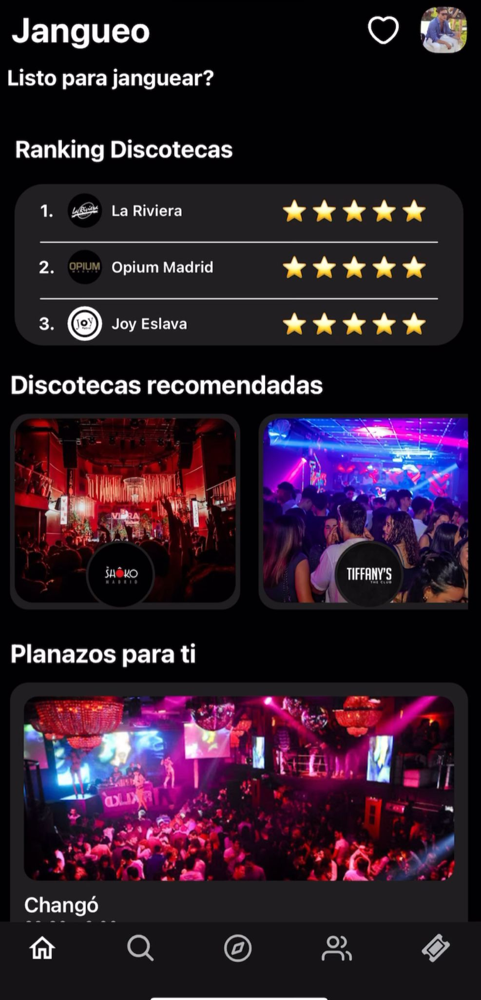
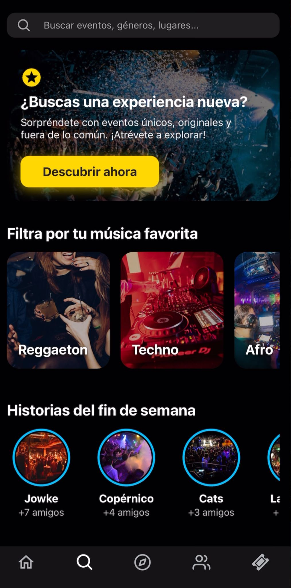
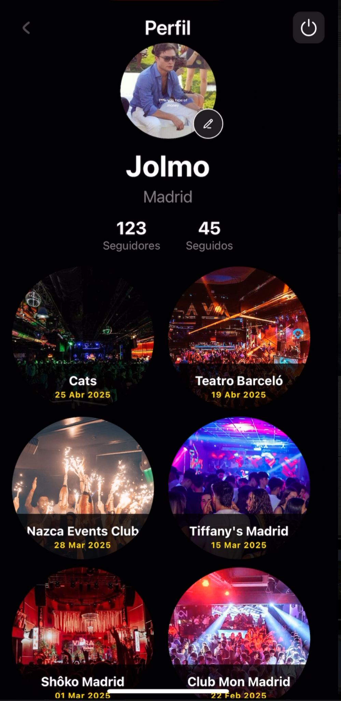
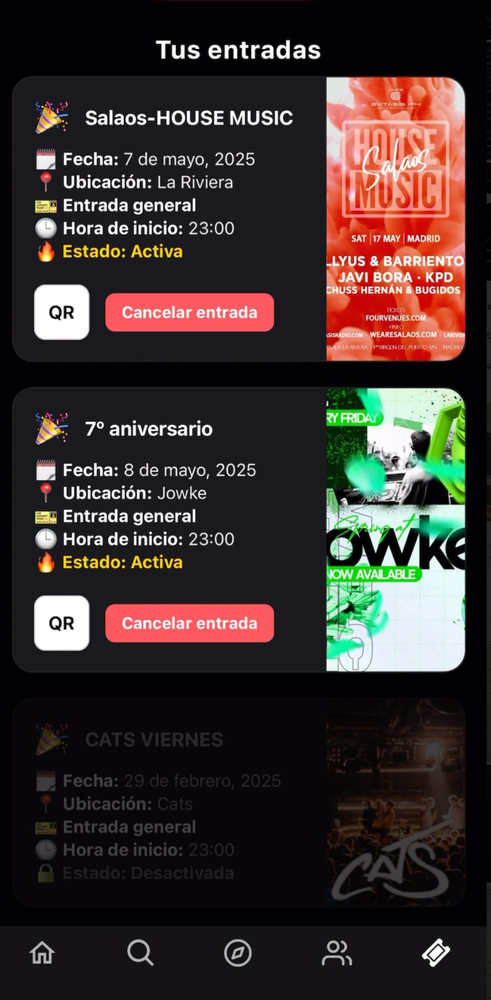

# Jangueo – Social Nightlife App Prototype

**Jangueo** is a mobile prototype for a social nightlife application in Madrid, designed to help users discover events, manage their tickets, and connect with friends. The app was built as a front-end and basic back-end prototype to explore core social and event-related interactions.

---

## Overview

- **Purpose:** Prototype for a nightlife social app, including event discovery, ticket management, and user profiles.  
- **Scope:** Fully implemented front-end prototype; basic backend for content upload and data persistence. Advanced features like real-time maps and recommendations were planned but not implemented.  
- **Role:** Designed and developed the front-end UI and workflows; implemented a basic backend to support data storage and retrieval.

---

## Features Implemented

- **Home / My Tickets:** Users can view their upcoming events and tickets.  
- **Search Events:** Browse and search for events in Madrid.  
- **User Profile:** View user information and attendance history.  
- **Edit Profile:** Update profile details and preferences.  
- **Front-end Architecture:** Built with React Native, structured for future backend integration.  
- **Backend:** Minimal implementation for storing and retrieving content; API endpoints for front-end communication.

---

## Technology Stack

- **Front-end:** React Native  
- **Back-end:** Node.js (Express)  
- **Database:** SQLite / JSON-based prototype  
- **Version Control:** Git  
- **Other Tools:** Postman (for API testing), npm

---

## Screenshots

  
  
  

---

## What I Learned

- Designing mobile UI/UX for ticket management and social interaction.  
- Structuring front-end architecture for a scalable prototype.  
- Connecting front-end to a basic back-end for data persistence.  
- Planning features beyond the prototype while maintaining realistic scope.

---

## Future Work

- Implement real-time maps for event discovery.  
- Add recommendation engine for personalized events.  
- Enhance backend with persistent database and authentication.  
- Develop ticket purchasing and payment flow.

---

**Note:** This project is a personal prototype for learning purposes and is **not deployed to production**. All data is simulated.
